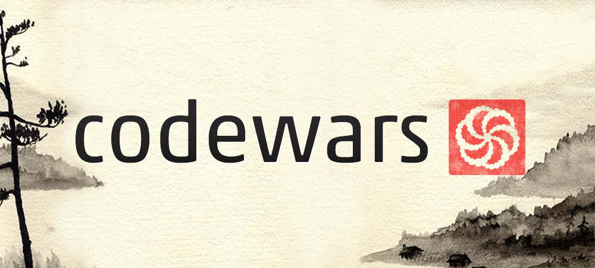
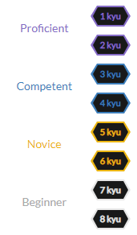

# CodeWars Solutions

I welcome all programming lovers to my repository dedicated to solving problems from a wonderful site: https://www.codewars.com/dashboard .
It is great for solving problems for learning a new programming language, as well as for having fun when you solve complex algorithmic problems. In addition, this site presents a convenient complexity system:

Before viewing the solutions, I ask you first:
+ Familiarize yourself with the task
+ Try to decide for yourself
+ Do not copy my solution, this repository was created solely for educational purposes.

Almost all solutions are given in one of the following languages:
+ Python
+ C++
+ C
+ SQL

If you like my solutions, add me as a friend: https://www.codewars.com/users/Mickey%20Mouse%202048
